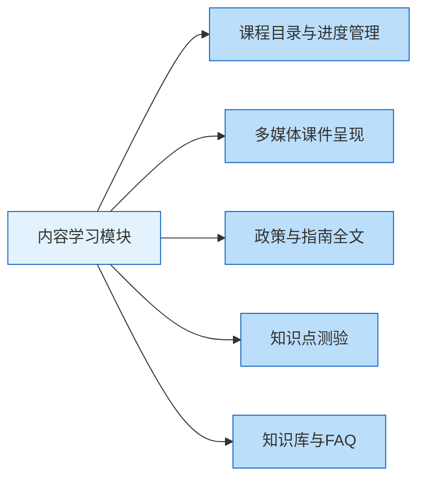
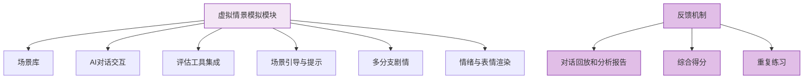
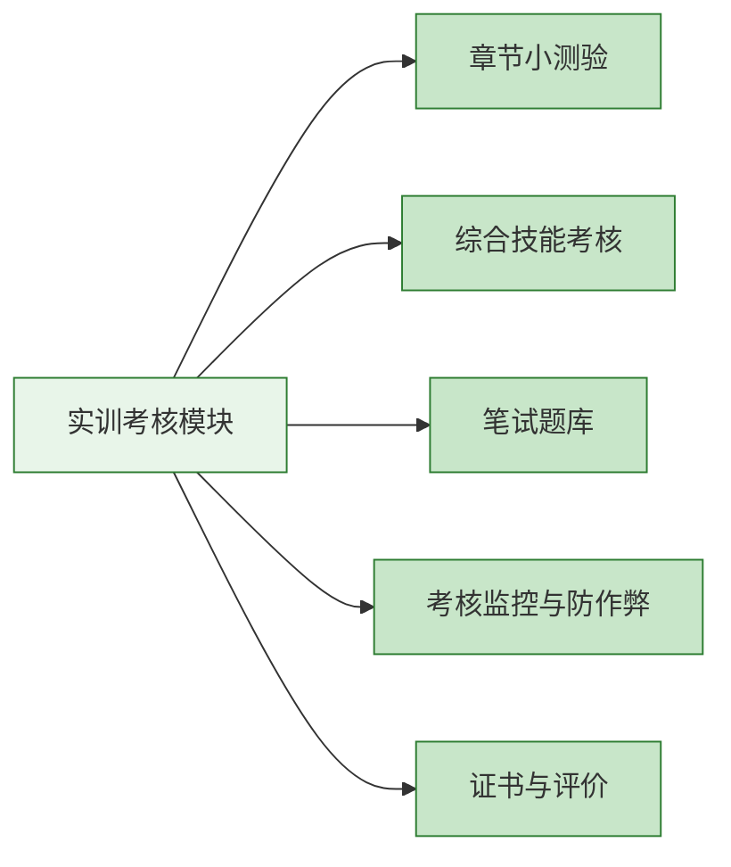
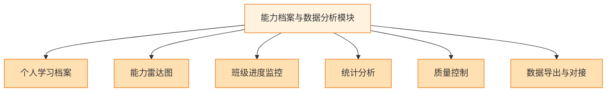
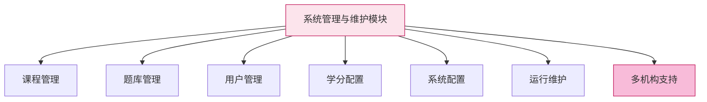
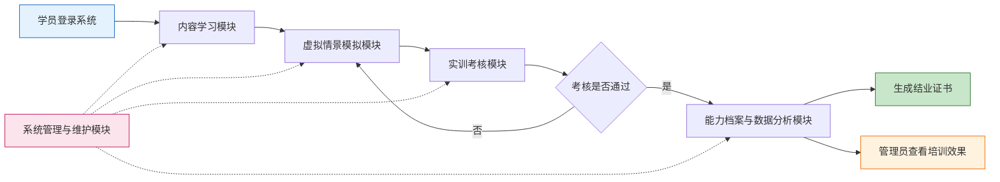

# 系统功能设计  

针对上述需求，本智能培训系统将包含以下主要功能模块：

#### 1. 内容学习模块

**模块概述：** 提供PND相关知识的系统化在线课程，内容按照THP框架分单元组织，从基础理论到流程规范逐级展开。
**主要功能点：**
| 功能类别                                                     | 具体功能                             | 特色设计                                     |
| :----------------------------------------------------------- | :----------------------------------- | :------------------------------------------- |
| **基础学习**                                                 | 课程目录与进度管理 多媒体课件呈现 | 支持书签和断点续学 富媒体课件提升学习兴趣 |
| **知识测验**                                                 | 知识点测验                           | 即时检验理解，答题后反馈解析                 |
| **参考资源**                                                 | 政策与指南全文 知识库与FAQ        | 培养循证意识 便于随时查询常见问题         |
| **实用性与本土化：** 结合中国案例说明家属参与的重要性；引用国内调查数据；在介绍筛查量表时加入护理提示（如何在访视中自然引入问卷）。 |                                      |                                              |
---
#### 2. 虚拟情景模拟模块

**模块概述：** 采用AI虚拟仿真技术，提供多个精心设计的围产期抑郁案例场景，允许学员以第一视角与“虚拟患者”互动，练习评估和沟通技能。
**主要功能点：**
| 功能类别                                                     | 具体功能                                     | 技术实现                                                     |
| :----------------------------------------------------------- | :------------------------------------------- | :----------------------------------------------------------- |
| **场景构建**                                                 | 场景库（不少于10个案例） 多分支剧情       | 按情境分类，每个场景有具体背景说明 根据学员决策引导不同走向 |
| **交互技术**                                                 | AI对话交互 评估工具集成 情绪与表情渲染 | 文本或语音对话 调用EPDS、PHQ-9、GAD-7量表 2D动画/头像展示情绪状态 |
| **学习辅助**                                                 | 场景引导与提示                               | 智能提示模式可调节频度 培养独立判断能力                   |
| **反馈机制：** 场景结束后生成详细的分析报告，包括关键行为覆盖、风险信号遗漏、共情语句使用等，计算综合得分支持重复练习。 |                                              |                                                              |
---
#### 3. 实训考核模块

**模块概述：** 用于对学员进行阶段性和结业性的考核评估，确保培训达成预期教学目标，并符合继续教育考核规范。
**考核体系构成：**
| 考核类型             | 功能特点                                   | 适用场景                       |
| :------------------- | :----------------------------------------- | :----------------------------- |
| **章节小测验**       | 5~10题，即时显示分数和解析                 | 理论学习后即时检验             |
| **综合技能考核**     | 模拟案例综合考核 静默记录行为不提供提示 | 培训后期结业评估（相当于OSCE） |
| **笔试题库**         | 约200题客观题 支持自动判分 定期更新  | 结业理论考试                   |
| **考核标准与保障：** |                                            |                                |
- **标准对照**：严格对照国家规范制定（如EPDS≥13需转诊、遵循“知情同意”原则）
- **防作弊机制**：摄像头监考、人脸识别、防切屏、限制账号共用
- **证书认证**：自动生成培训结业证书，注明继续教育学分和成绩，有唯一编码供核验
---
#### 4. 能力档案与数据分析模块

**模块概述：** 负责收集整理学员在系统中的各项数据，并以直观方式呈现个人能力档案和整体培训效果分析，辅助教学管理决策。
**核心功能矩阵：**
| 功能类别           | 面向对象    | 主要价值                                                     |
| :----------------- | :---------- | :----------------------------------------------------------- |
| **个人能力追踪**   | 学员        | 电子档案记录学习历程 雷达图展示核心能力得分 发现短板定向提升 |
| **教学管理支持**   | 管理员/导师 | 班级进度监控督促指导 大数据分析挖掘教学难点 质量控制评估培训效果 |
| **系统集成扩展**   | 系统管理员  | 数据导出Excel/PDF API接口对接上级系统 支持职称晋升考评 |
| **数据分析维度：** |             |                                                              |
- **基础统计**：平均考试分、分数分布曲线、各知识点正确率
- **深度挖掘**：模拟场景中最常见的错误应对举动、不同时期培训班成绩对比
- **效果评估**：与院内实际指标关联（如培训后产后抑郁筛查率、转介率）
---
#### 5. 系统管理与维护模块

**模块概述：** 面向系统管理员和课程维护人员的后台功能，保证系统内容及时更新、运行稳定，以及不同机构的灵活部署需求。
**后台管理功能：**
| 管理领域                       | 核心功能                 | 扩展特性                                                     |
| :----------------------------- | :----------------------- | :----------------------------------------------------------- |
| **内容维护**                   | 课程管理 题库管理     | 支持版本管理、多语言扩展 模拟场景脚本图形化编辑           |
| **用户管理**                   | 用户账户管理 学分配置 | 批量导入学员信息 设置学分参数和学时换算规则               |
| **系统运维**                   | 系统配置 运行维护     | 本地化设置（单位名称、LOGO） 性能监控、数据备份、日志查询 |
| **多机构支持（多租户模式）：** |                          |                                                              |
- **部署架构**：一套平台允许不同医院/学校作为独立租户使用
- **数据隔离**：各单位数据相互隔离，管理员只可管理本机构学员
- **推广优势**：便于省级或协会级部署，为多个下属单位开通账户，保持标准一致又支持自有培训
---
### 🎯 模块协同与数据流转

**数据流转说明：**
1.  **学习循环**：学员从内容学习进入虚拟情景模拟，通过实践后参加实训考核
2.  **反馈闭环**：考核未通过返回模拟模块重复练习，通过后进入能力档案模块
3.  **后台支撑**：系统管理模块为所有业务模块提供内容、用户、配置等基础支撑
4.  **成果输出**：最终生成结业证书给学员，为管理员提供培训效果数据支持决策
这种模块化设计既保证了各功能的独立性，又通过数据流转实现了整体协同，能够有效支撑从学习到考核再到管理的完整培训流程。