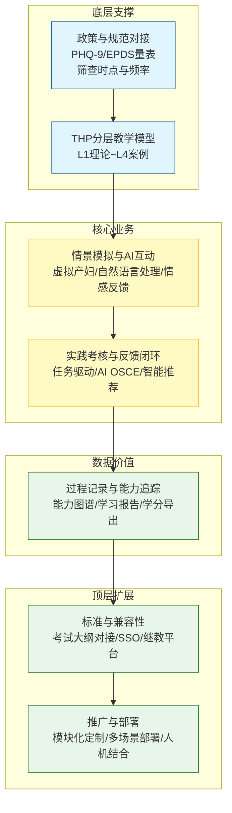
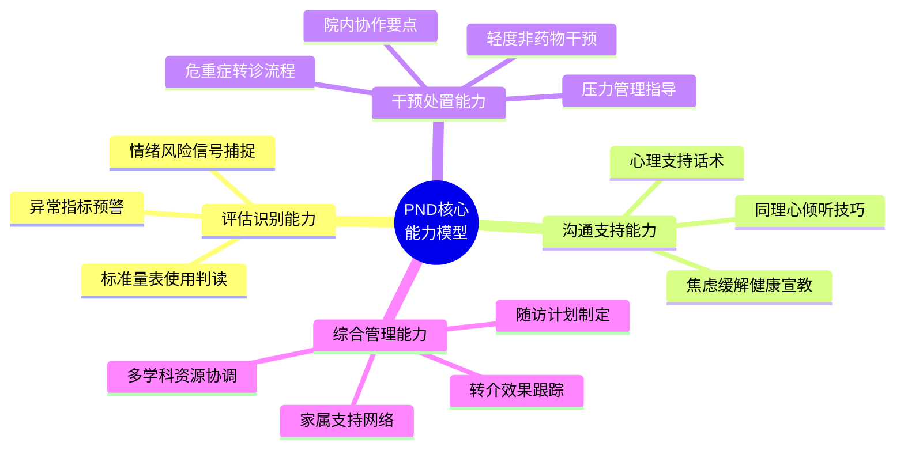
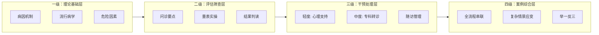
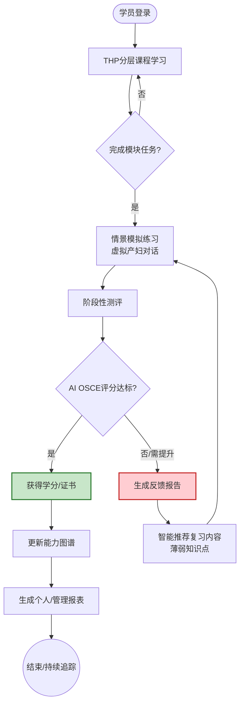

# 需求拆解

根据背景调研和用户分析，本项目的需求要点可总结为以下几个方面：

1. **政策与规范对接：**系统内容必须符合国家关于围产期心理健康管理的政策文件和行业指南要求。例如涵盖**孕期至产后的抑郁筛查时点、频率、量表工具（PHQ-9、EPDS等）**，以及筛查阳性后的处理流程。确保培训教材使用的定义、标准与国家规范一致，使学员学到的即是临床要求做到的。  

2. **核心能力培养：**针对当前护士在PND识别、干预、转介方面的能力缺口，提炼出培训应重点培养的核心能力指标，包括：  

   - **评估识别能力：**能及早发现孕产妇的异常情绪和抑郁风险信号，正确使用标准筛查量表评分和结果判读。  
   - **沟通与支持能力：**掌握与产妇及其家属沟通技巧，能以同理心倾听并提供心理支持，进行健康宣教缓解焦虑。  
   - **干预处置能力：**了解常用的非药物干预方法（如心理疏导、压力管理技巧）并能指导轻度抑郁产妇进行自助调适。对于严重者，知晓转诊流程和院内协作要点。  
   - **综合管理能力：**学会制定随访计划，结合家属支持网络开展连续性护理，跟踪转介效果，协调多学科资源（心理科、妇产科、社区）共同管理患者。  

3. **THP模型分层教学：**采用THP（Total Health Promotion，全程健康促进）干预框架，将PND管理全过程拆解为**模块化知识单元**，按由浅入深、多层次路径进行教学。具体结构为：  

   - **一级：理论基础层。**介绍围产期心理健康基础知识，包括PND的病因机制、流行病学数据、危险因素和预防策略等（对应一级预防理念）。  
   - **二级：评估筛查层。**详细讲授PND识别评估方法，如问诊要点、心理评估量表的使用与注意事项（对应二级预防，即早期筛查诊断）。  
   - **三级：干预处理层**（重点）。基于**THP干预框架**，讲解针对不同严重程度PND的处理流程：轻度者在产科/社区进行心理支持，中度以上及时专科转诊及治疗，以及后续随访管理（对应三级预防，及时干预与复发预防）。  
   - **四级：案例综合层。**通过完整案例串联起评估到干预的流程，训练学员融会贯通，做到举一反三。这种分层设计使学员逐步掌握从知识到应用的全链条能力。  

4. **情景模拟与AI互动：**系统需内置高度仿真的**虚拟患者情境模拟**功能。利用AI驱动的交互式对话技术，实现护士与虚拟产妇的实时交流训练。例如：  

   - 情景一：产后3天的产妇出现情绪低落，学员通过与虚拟产妇对话，收集症状（如睡眠、食欲、心情），判断是否可能抑郁，并选择合适量表进行评估。AI根据学员提问给予不同回应，模拟真实沟通。  
   - 情景二：筛查评分显示抑郁高风险，学员需向产妇解释结果，提供心理支持并建议后续就医。AI患者可能表现出抗拒、担忧等情绪，学员练习应对技巧。  
   - 情景三：产后42天访视场景，学员对虚拟产妇进行例行心理评估并询问家庭支持情况，根据虚拟产妇反馈调整干预措施。  

   系统应提供多种典型场景（孕期焦虑、产后抑郁伴躯体症状、伴有家庭矛盾等），覆盖孕前至产后一年的关键节点。通过**角色扮演式**互动，强化学员在复杂情境下的观察、沟通和决策能力。AI模拟要具备**自然语言处理**和**情感反馈**功能，支持中文语音或文字交互，让护士有身临其境之感。  

5. **实践考核与反馈闭环:** 培训系统需设计**任务导向**的实操练习和考核机制，形成学练考一体的闭环：  

   - **任务驱动学习：**每个模块设置若干实践任务，例如填写一份EPDS评估结果并解读、拟定一份干预计划、完成一次转介流程表单等。任务可基于虚拟案例完成。  
   - **阶段测评：**在重要学习节点进行小测验或情景考核。如理论模块后进行选择题测验，场景模拟模块后进行案例分析问答。  
   - **虚拟患者考核：**引入**AI OSCE**（客观结构化临床考核）形式。学员进入随机分配的模拟情境，需要在限定时间内完成从评估到干预的全过程。系统根据学员的提问是否全面、判断是否准确、干预决策是否合理等给予评分。  
   - **即时反馈：**所有练习和考核均提供详细反馈报告。例如错题解析、与标准答案的差距；虚拟对话考核则给出行为评价（如“在收集病史时漏问了睡眠情况”或“未能及时共情安抚患者”），并给出改进建议。学员可根据反馈反复练习，直至达到满意表现。  
   - **反馈纠偏：**系统根据学员表现**智能推荐**复习内容。如多名学员在同一知识点反复出错，系统后台生成警报，提示课程设计者加强该部分内容。对个人而言，系统可以在其练习首页推送其薄弱环节的强化练习题。  

   通过考核-反馈闭环，确保学员发现不足并及时纠正，不断提高实际能力。整个培训过程形成良性循环，使培训效果最大化。

6. **过程记录与能力追踪：**系统需具备完善的学习过程数据记录和可视化分析功能。一方面，记录每位学员的学习行为数据，包括课件学习时长、练习完成情况、考核成绩、模拟对话日志等。另一方面，将这些数据转化为**能力成长档案**，便于学员和管理员查看：  

   - **能力图谱：**以雷达图或柱状图展示学员在不同能力维度（识别、沟通、干预、知识掌握等）的评分，直观反映强项和弱项。  
   - **学习进度：**显示已完成课程比例、通过考核数、获得学分数等，使学员了解距离培训目标的差距。  
   - **个性报告：**定期生成学习报告，包括阶段性进步、尚存不足，建议下阶段重点练习内容等，帮助学员制定自我提升计划。  
   - **管理视图：**培训管理员可查看全体学员的总体情况统计，如合格率、优秀率，以及各知识点正确率。这便于评估培训成效，调整教学策略。

   此外，系统需支持按照继续教育学分管理要求导出培训纪录。包括每名学员的学习学时、在线考勤、考核通过证明等，以备上传至国家或省继教平台审核，确保**学分认证规范**。过程数据的客观记录也保障了培训的公正透明。

7. **标准与兼容性：**系统设计需满足国家医学考试和继续教育的标准化要求。例如在内容深度和考核难度上，与护理专业技术资格考试和专科护士培训大纲接轨，确保培训所得与职业考试要求一致。在学分授予上，遵循继续医学教育学分授予办法，如**每完成一定学时并通过考核授予相应学分**。系统输出的证书应包含必要信息（项目名称、学员姓名、学分数、项目编号等）以便主管部门认可。技术上，系统需要与现有医疗教育系统兼容，可对接医院培训管理平台或区域继教系统，实现用户单点登录和数据共享。这能方便护理管理部门将本系统融入常规培训流程，不增加额外管理负担。

8. **推广与部署：**为确保系统具有可复制性和广泛应用价值，需满足以下推广需求：  

   - **模块化可定制：**系统内容应模块化，支持根据不同地区、不同行业标准进行调整。例如可以根据各省市妇幼流程细节或医院自身规范定制部分培训内容，使系统适应本地需求。  
   - **多场景部署方案：**提供灵活的部署方式，可在**教学、临床、社区**多场景下应用。在教学场景下，可采用云平台集中部署，师生通过网页或APP登录使用；在医院临床，可局域网部署保障数据安全，护士利用业余时间上线学习；在偏远社区，可提供离线包或平板终端，方便网络不佳地区使用。  
   - **培训师资融入：**系统考虑接入人机结合的培训模式，可让经验丰富的心理护士或助产士以导师身份入驻平台，定期线上答疑或点评学员模拟操作视频，形成**AI指导+人工导师**的混合教学，提高培训说服力和效果。  
   - **推广支持：**配套制定系统推广实施策略，如**培训管理部门接入机制**：与各地护理学会、妇幼保健协会合作，将系统纳入其培训项目清单，通过官方渠道推广；举办试点示范班，总结经验后在全国复制推广。系统使用收益模式清晰（如按学员数授权等），为各级单位接受提供便利。  
   - **持续更新和维护：**建立长效维护机制，根据政策更新和用户反馈定期升级内容功能。例如当国家出台新指南或量表，及时更新课程；采纳学员和专家建议优化用户体验等。这保证系统生命力，便于长期推广应用。

---

### 1. 系统总体功能架构图

此图展示了系统从底层的政策合规到顶层的推广部署的整体架构关系。

---
### 2. 核心能力培养模型
此图展示了护士在 PND 管理中需要培养的四大核心能力及其包含的具体技能。

---
### 3. THP 模型分层教学路径
此图描述了学员从基础理论到综合实战的学习进阶路径。

---
### 4. 情景模拟典型场景矩阵表
下表列出了系统需内置的典型虚拟产妇场景，覆盖不同的时间节点和核心任务。
| 场景ID  | 场景名称         |  时间节点  | 核心任务           | AI产妇特征         | 交互目标                   |
| :-----: | :--------------- | :--------: | :----------------- | :----------------- | :------------------------- |
| **S01** | **产后情绪低落** |  产后3天   | 收集症状、初步评估 | 情绪低落、沉默寡言 | 练习开放式提问技巧         |
| **S02** | **高风险干预**   | 筛查阳性后 | 结果解释、心理支持 | 抗拒治疗、担忧病情 | 练习共情与依从性建立       |
| **S03** | **产后42天访视** |  产后42天  | 例行评估、家庭支持 | 配合检查、家庭矛盾 | 练习家庭资源挖掘与协调     |
| **S04** | **孕期焦虑缓解** |   孕晚期   | 风险识别、健康宣教 | 紧张不安、躯体不适 | 练习呼吸放松指导           |
| **S05** | **重度抑郁识别** |  产后1周   | 危机干预、转诊决策 | 悲观厌世、消极言语 | 练习自杀风险筛查           |
| **S06** | **哺乳期抑郁**   |  产后2周   | 哺乳指导、情绪疏导 | 内疚自责、拒绝哺乳 | 练习针对哺乳问题的心理支持 |
---
### 5. 学-练-考-评 闭环流程图
此图展示了从学员进入系统到能力提升的完整数据闭环。

---
### 6. 数据追踪与可视化功能表
下表定义了系统对不同角色提供的数据视图功能。
| 功能模块     |   功能名称   |  用户角色  | 核心指标/展示内容                    | 应用价值                   |
| :----------- | :----------: | :--------: | :----------------------------------- | :------------------------- |
| **个人学习** |   能力图谱   |    护士    | 雷达图 (识别/沟通/干预/知识)         | 直观展示个人强项与弱项     |
|              |   学习进度   |    护士    | 课程完成度、演练次数、考核通过率     | 明确距离培训目标的差距     |
|              |   个性报告   |    护士    | 阶段性进步曲线、改进建议             | 辅助制定自我提升计划       |
| **后台管理** |   管理视图   |   管理员   | 全体合格率、优秀率、知识点正确率分布 | 评估培训成效，调整教学策略 |
|              |   学分管理   |   管理员   | 学习时长、考勤记录、考核证明         | 对接国家继教平台审核       |
| **预警系统** | 内容优化警报 | 课程设计者 | 某知识点全员错误率过高提示           | 提示加强该部分教学内容     |
---
### 7. 推广部署方案概览表
下表总结了系统在不同应用场景下的部署策略。
| 部署场景     | 适用对象     |   推荐部署方式    | 关键特性                   | 解决问题                     |
| :----------- | :----------- | :---------------: | :------------------------- | :--------------------------- |
| **教学场景** | 护校师生     |  云平台集中部署   | 高并发、账号体系、作业管理 | 大规模教学、统一考核         |
| **临床场景** | 院内护士     | 局域网/私有云部署 | 数据安全、SSO单点登录      | 医院数据安全、融入工作流     |
| **社区场景** | 基层公卫护士 |  离线包/平板终端  | 断网可用、轻量化           | 解决偏远地区网络差问题       |
| **全院推广** | 护理部       |    混合云部署     | 数据互通、定制化内容       | 满足不同层级医院的个性化需求 |