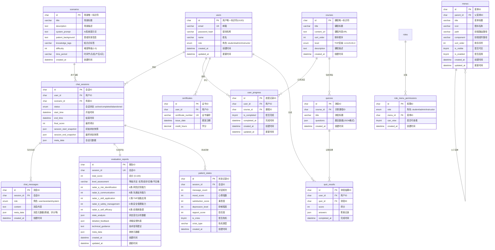

# PANDA 数据库设计文档

> 基于实际SQL文件 (panda.sql) 更新
> 更新时间：2026-01-30
> 数据架构：Redis (实时) + MySQL (持久化)

---

## 数据库设计原则

1. **无物理外键**：表与表之间通过 `*_id` 字段在逻辑上关联，不在数据库层面强制约束。
2. **JSON 友好**：大量使用 `json/text` 字段存动态配置（如 Prompt、评分细则、分支脚本），减少表数量。
3. **ID 统一**：所有主键使用 `char(36)` UUID，方便前后端与分布式处理。
4. **时间戳统一**：使用 `datetime` 类型，`created_at` 默认 `CURRENT_TIMESTAMP`，`updated_at` 自动更新。
5. **混合存储**：Redis存储实时状态（高QPS），MySQL存储持久化数据（历史查询）。

---

## 存储架构设计

### Redis + MySQL 混合存储

```
┌─────────────────────────────────────────────────────────────┐
│                      Redis (实时状态层)                      │
│  ┌─────────────────────────────────────────────────────┐   │
│  │ Key: patient:state:{session_id}                    │   │
│  │ TTL: 24小时 (自动过期)                              │   │
│  │ Type: Hash                                          │   │
│  │ {                                                  │   │
│  │   mood_score: 45,                                  │   │
│  │   satisfaction_score: 42,                          │   │
│  │   depression_level: 65,                            │   │
│  │   rapport_score: 40,                               │   │
│  │   message_count: 3,                                │   │
│  │   is_crisis: false,                                │   │
│  │   last_updated: 1706600000                         │   │
│  │ }                                                  │   │
│  └─────────────────────────────────────────────────────┘   │
│                                                             │
│  ┌─────────────────────────────────────────────────────┐   │
│  │ Key: patient:history:{session_id}                  │   │
│  │ Type: List (最近50轮对话)                            │   │
│  │ [                                                  │   │
│  │   {"role": "user", "content": "...", "state": {...}},  │
│  │   {"role": "assistant", "content": "...", "state": {...}} │
│  │ ]                                                  │   │
│  └─────────────────────────────────────────────────────┘   │
└─────────────────────────────────────────────────────────────┘
                            ↑ 同步
                            ↓
┌─────────────────────────────────────────────────────────────┐
│                      MySQL (持久化层)                        │
│  ┌─────────────────────────────────────────────────────┐   │
│  │ patient_states (状态历史记录表)                     │   │
│  │ - 每次状态变更时INSERT一条新记录                     │   │
│  │ - 用于场景复现、数据分析、审计追溯                    │   │
│  └─────────────────────────────────────────────────────┘   │
│                                                             │
│  ┌─────────────────────────────────────────────────────┐   │
│  │ chat_sessions (会话主表)                            │   │
│  │ - session_start_snapshot: 初始状态JSON               │   │
│  │ - session_end_snapshot: 最终状态JSON                 │   │
│  └─────────────────────────────────────────────────────┘   │
└─────────────────────────────────────────────────────────────┘
```

### Redis数据结构详细设计

#### 1. 实时状态 (patient:state:{session_id})

| 字段 | 类型 | 说明 |
|------|------|------|
| mood_score | int | 心情指数 (0-100) |
| satisfaction_score | int | 满意度 (0-100) |
| depression_level | int | 抑郁程度 (0-100) |
| rapport_score | int | 信任度 (0-100) |
| message_count | int | 对话轮次 |
| is_crisis | bool | 是否危机状态 |
| crisis_type | string | 危机类型 (可选) |
| last_updated | timestamp | 最后更新时间 |

**TTL策略**: 24小时自动过期（会话结束后保留1天用于复现）

#### 2. 对话历史快照 (patient:history:{session_id})

```python
{
    "role": "user" | "assistant",
    "content": "消息内容",
    "state_snapshot": {  # 发送消息后的状态快照
        "mood_score": 45,
        "satisfaction_score": 42,
        ...
    },
    "metadata": {
        "timestamp": 1706600000,
        "triggered_action": null  # 量表触发等
    }
}
```

**容量限制**: 保留最近50轮对话（Redis List自动修剪）

---

## 数据库 ER 图



---

## 表结构详细说明

### 1. 用户与认证模块

#### 1.1 users（系统用户表）

| 字段名 | 类型 | 约束 | 说明 |
|--------|------|------|------|
| id | char(36) | PK | 用户唯一标识符(UUID) |
| email | varchar(255) | UK | 登录邮箱 |
| password_hash | varchar(255) | NOT NULL | 密码哈希 (bcrypt) |
| name | varchar(100) | NOT NULL | 姓名/昵称 |
| role | enum | NOT NULL | 角色: student/admin/instructor |
| created_at | datetime | DEFAULT CURRENT_TIMESTAMP | 创建时间 |
| updated_at | datetime | ON UPDATE CURRENT_TIMESTAMP | 更新时间 |

**索引**：
- PRIMARY KEY (id)
- UNIQUE KEY email
- INDEX idx_email, idx_role

**预设数据**：
- admin@panda.com (admin) - 系统管理员
- teacher@panda.com (instructor) - 王老师
- li.instructor@panda.com (instructor) - 李讲师
- nurse1@hospital.com (student) - 张护士
- nurse2@hospital.com (student) - 刘护士

---

### 2. 课程与学习模块

#### 2.1 courses（THP分层课程表）

| 字段名 | 类型 | 约束 | 说明 |
|--------|------|------|------|
| id | char(36) | PK | 课程唯一标识符 |
| title | varchar(255) | NOT NULL | 课程标题 |
| content_url | text | - | 课程内容URL或路径 (PDF/视频等) |
| sort_order | int | DEFAULT 0 | 排序顺序 |
| level | enum | NOT NULL | THP层级: L1/L2/L3/L4 |
| description | text | - | 课程描述 |
| created_at | datetime | DEFAULT CURRENT_TIMESTAMP | 创建时间 |

**索引**：
- PRIMARY KEY (id)
- INDEX idx_level, idx_sort

**THP层级说明**：
- **L1** - 基础认知：围产期抑郁概述、筛查识别、基础沟通
- **L2** - 进阶技能：心理支持技术、危机干预基础、家庭评估
- **L3** - 专业应用：CBT入门、药物治疗知识
- **L4** - 高级管理：多学科协作、案例督导

**预设课程** (10门)：
1. 围产期抑郁概述 (L1)
2. 围产期抑郁的识别与筛查 (L1)
3. 基础沟通技巧 (L1)
4. 心理支持技术 (L2)
5. 危机干预基础 (L2)
6. 家庭支持系统评估 (L2)
7. 认知行为疗法入门 (L3)
8. 药物治疗知识 (L3)
9. 多学科协作 (L4)
10. 案例督导与反思 (L4)

#### 2.2 user_progress（用户学习进度表）

| 字段名 | 类型 | 约束 | 说明 |
|--------|------|------|------|
| id | char(36) | PK | 进度记录ID |
| user_id | char(36) | FK | 用户ID (逻辑关联 users.id) |
| course_id | char(36) | FK | 课程ID (逻辑关联 courses.id) |
| is_completed | tinyint(1) | DEFAULT 0 | 是否完成 |
| completed_at | datetime | - | 完成时间 |
| created_at | datetime | DEFAULT CURRENT_TIMESTAMP | 创建时间 |
| updated_at | datetime | ON UPDATE CURRENT_TIMESTAMP | 更新时间 |

**索引**：
- PRIMARY KEY (id)
- INDEX idx_user_course (user_id, course_id)
- INDEX idx_completed

---

### 3. 情景模拟模块

#### 3.1 scenarios（虚拟患者场景配置表）

| 字段名 | 类型 | 约束 | 说明 |
|--------|------|------|------|
| id | char(36) | PK | 场景唯一标识符 |
| title | varchar(255) | NOT NULL | 场景标题 |
| description | text | - | 场景描述 |
| system_prompt | text | NOT NULL | AI系统提示词 (Patient-Agent使用) |
| patient_background | text | - | 患者背景信息 |
| knowledge_tags | varchar(500) | - | 知识点标签 (逗号分隔) |
| difficulty | int | DEFAULT 1 | 难度等级 (1-5) |
| time_period | varchar(50) | - | 时间节点 (如: 产后2周) |
| created_at | datetime | DEFAULT CURRENT_TIMESTAMP | 创建时间 |

**索引**：
- PRIMARY KEY (id)
- INDEX idx_difficulty

**预设场景** (5个)：
1. **s-001** 产后情绪低落初筛 (难度1) - 产后2周初访
2. **s-002** 轻度抑郁情绪支持 (难度2) - EPDS 12分
3. **s-003** 家庭支持不足的产妇 (难度3) - 单亲妈妈，轻度自杀意念
4. **s-004** 拒绝承认问题的产妇 (难度3) - 完美主义，否认心理
5. **s-005** 严重抑郁伴自杀风险 (难度5) - 危机干预场景

---

### 4. 对话交互模块

#### 4.1 chat_sessions（AI对话会话记录表）

| 字段名 | 类型 | 约束 | 说明 |
|--------|------|------|------|
| id | char(36) | PK | 会话ID |
| user_id | char(36) | FK | 用户ID (逻辑关联 users.id) |
| scenario_id | char(36) | FK | 场景ID (逻辑关联 scenarios.id) |
| status | enum | DEFAULT 'active' | 会话状态: active/completed/abandoned |
| start_time | datetime | DEFAULT CURRENT_TIMESTAMP | 开始时间 |
| end_time | datetime | - | 结束时间 |
| final_score | int | - | 最终得分 (0-100) |
| session_start_snapshot | json | - | 初始状态快照 (场景复现用) |
| session_end_snapshot | json | - | 最终状态快照 (场景复现用) |
| meta_data | json | - | 会话元数据 |

**索引**：
- PRIMARY KEY (id)
- INDEX idx_user, idx_status

**快照数据结构**:
```json
{
  "patient_state": {
    "mood_score": 50,
    "satisfaction_score": 40,
    "depression_level": 60,
    "rapport_score": 40,
    "message_count": 0
  },
  "scenario_config": {
    "id": "s-001",
    "title": "产后情绪低落初筛",
    "system_prompt": "...",
    "patient_background": "..."
  },
  "timestamp": "2026-01-30T10:00:00Z"
}
```

#### 4.2 chat_messages（对话消息明细表）

| 字段名 | 类型 | 约束 | 说明 |
|--------|------|------|------|
| id | char(36) | PK | 消息ID |
| session_id | char(36) | FK | 会话ID (逻辑关联 chat_sessions.id) |
| role | enum | NOT NULL | 角色: user/assistant/system |
| content | text | NOT NULL | 消息内容 |
| meta_data | json | - | 消息元数据 (情绪、评分等) |
| created_at | datetime | DEFAULT CURRENT_TIMESTAMP | 创建时间 |

**索引**：
- PRIMARY KEY (id)
- INDEX idx_session, idx_created

---

### 5. 病人状态模块 (Redis + MySQL)

#### 5.1 patient_states（病人状态历史表）

**说明**: 每次状态变更时INSERT一条新记录，用于：
1. 场景复现 - 重新进入会话时恢复状态
2. 数据分析 - 追踪状态变化趋势
3. 审计追溯 - 查看历史操作

| 字段名 | 类型 | 约束 | 说明 |
|--------|------|------|------|
| id | char(36) | PK | 状态记录ID |
| session_id | char(36) | FK | 会话ID (逻辑关联 chat_sessions.id) |
| message_count | int | DEFAULT 0 | 对话轮次 |
| mood_score | int | - | 心情指数 (0-100) |
| satisfaction_score | int | - | 满意度 (0-100) |
| depression_level | int | - | 抑郁程度 (0-100) |
| rapport_score | int | - | 信任度 (0-100) |
| is_crisis | tinyint(1) | DEFAULT 0 | 是否危机状态 |
| crisis_type | varchar(50) | - | 危机类型 |
| created_at | datetime | DEFAULT CURRENT_TIMESTAMP | 创建时间 |

**索引**：
- PRIMARY KEY (id)
- INDEX idx_session (session_id)
- INDEX idx_created
- INDEX idx_crisis (is_crisis)

**数据同步策略**:
```python
# 每次状态更新时
async def update_state(session_id: str, updates: dict):
    # 1. 更新Redis (实时)
    await redis.hset(f"patient:state:{session_id}", mapping=updates)

    # 2. 异步写入MySQL (持久化)
    background_task.add(
        insert_patient_state,
        session_id=session_id,
        state=updates
    )
```

---

### 6. 评估与反馈模块

#### 6.1 evaluation_reports（评估报告表）

| 字段名 | 类型 | 约束 | 说明 |
|--------|------|------|------|
| id | char(36) | PK | 报告ID |
| session_id | char(36) | UK | 会话ID (逻辑关联 chat_sessions.id) |
| total_score | int | - | 总分 (0-100) |
| level_assessment | varchar(20) | - | 等级评定: 优秀/良好/合格/不合格 |
| radar_a_risk_identification | int | - | A类-风险识别能力 (0-100) |
| radar_b_communication | int | - | B类-沟通支持能力 (0-100) |
| radar_c_skill_application | int | - | C类-THP技能应用 (0-100) |
| radar_d_safety_management | int | - | D类-安全管理能力 (0-100) |
| radar_e_self_efficacy | int | - | E类-自我效能感 (0-100) |
| state_analysis | json | - | 状态变化分析数据 |
| detailed_feedback | json | - | 详细反馈列表 |
| technical_guidance | text | - | 技术指导建议 |
| meta_data | json | - | 其他元数据 |
| created_at | datetime | DEFAULT CURRENT_TIMESTAMP | 创建时间 |
| updated_at | datetime | ON UPDATE CURRENT_TIMESTAMP | 更新时间 |

**索引**：
- PRIMARY KEY (id)
- UNIQUE KEY session_id
- INDEX idx_session

**五维评分说明**：
- **A类 (25分)** - 风险识别能力：睡眠障碍、食欲改变、自杀意念等信号识别
- **B类 (25分)** - 沟通支持能力：B1积极倾听、B2避免说教打断
- **C类 (25分)** - THP技能应用：C1识别不健康想法、C2挑战信念
- **D类 (15分)** - 安全管理能力：危机识别、转介流程（红线指标，一票否决）
- **E类 (10分)** - 自我效能感：综合胜任感

---

### 7. 测验与考试模块

#### 7.1 quizzes（测验表）

| 字段名 | 类型 | 约束 | 说明 |
|--------|------|------|------|
| id | char(36) | PK | 测验ID |
| course_id | char(36) | FK | 关联课程ID (逻辑关联 courses.id) |
| title | varchar(255) | NOT NULL | 测验标题 |
| questions | json | NOT NULL | 题目数据 (JSON格式) |
| created_at | datetime | DEFAULT CURRENT_TIMESTAMP | 创建时间 |

**索引**：
- PRIMARY KEY (id)

#### 7.2 quiz_results（测验结果表）

| 字段名 | 类型 | 约束 | 说明 |
|--------|------|------|------|
| id | char(36) | PK | 测验结果ID |
| user_id | char(36) | FK | 用户ID (逻辑关联 users.id) |
| quiz_id | char(36) | FK | 测验ID (逻辑关联 quizzes.id) |
| score | int | NOT NULL | 得分 |
| answers | json | - | 答案记录 |
| completed_at | datetime | DEFAULT CURRENT_TIMESTAMP | 完成时间 |

**索引**：
- PRIMARY KEY (id)
- INDEX idx_user_quiz (user_id, quiz_id)

---

### 8. 证书与认证模块

#### 8.1 certificates（培训证书表）

| 字段名 | 类型 | 约束 | 说明 |
|--------|------|------|------|
| id | char(36) | PK | 证书ID |
| user_id | char(36) | FK | 用户ID (逻辑关联 users.id) |
| certificate_number | varchar(100) | UK | 证书编号 |
| issue_date | datetime | DEFAULT CURRENT_TIMESTAMP | 颁发日期 |
| credit_hours | decimal(4,1) | DEFAULT 0.0 | 学分 |

**索引**：
- PRIMARY KEY (id)
- UNIQUE KEY certificate_number
- INDEX idx_user, idx_certificate_number

---

### 9. 系统与权限模块

#### 9.1 menus（系统菜单表）

| 字段名 | 类型 | 约束 | 说明 |
|--------|------|------|------|
| id | char(36) | PK | 菜单ID |
| parent_id | char(36) | FK | 父菜单ID (NULL表示顶级菜单) |
| title | varchar(100) | NOT NULL | 菜单标题 |
| icon | varchar(50) | - | 图标名称 (Ant Design Icons) |
| path | varchar(200) | - | 前端路由路径 |
| component | varchar(200) | - | 前端组件路径 |
| sort_order | int | DEFAULT 0 | 排序序号 (数字越小越靠前) |
| is_visible | tinyint(1) | DEFAULT 1 | 是否可见 (1=可见, 0=隐藏) |
| is_enabled | tinyint(1) | DEFAULT 1 | 是否启用 (1=启用, 0=禁用) |
| created_at | datetime | DEFAULT CURRENT_TIMESTAMP | 创建时间 |
| updated_at | datetime | ON UPDATE CURRENT_TIMESTAMP | 更新时间 |

**索引**：
- PRIMARY KEY (id)
- INDEX idx_parent, idx_sort, idx_enabled
- FOREIGN KEY (parent_id) REFERENCES menus(id) ON DELETE CASCADE

**预设菜单** (6个顶级菜单 + 3个子菜单)：
- 课程中心 (/courses)
- 情景模拟 (/scenarios)
- 对话练习 (/chat)
- 学习进度 (/progress)
- 系统管理 (/admin) → 用户管理、角色管理、菜单管理
- 个人中心 (/profile)

#### 9.2 role_menu_permissions（角色菜单权限关联表）

| 字段名 | 类型 | 约束 | 说明 |
|--------|------|------|------|
| id | char(36) | PK | 权限ID |
| role | enum | NOT NULL | 角色: student/admin/instructor |
| menu_id | char(36) | FK | 菜单ID (逻辑关联 menus.id) |
| can_view | tinyint(1) | DEFAULT 1 | 是否可查看 (1=可查看, 0=不可查看) |
| created_at | datetime | DEFAULT CURRENT_TIMESTAMP | 创建时间 |

**索引**：
- PRIMARY KEY (id)
- UNIQUE KEY unique_role_menu (role, menu_id)
- INDEX idx_role, idx_menu
- FOREIGN KEY (menu_id) REFERENCES menus(id) ON DELETE CASCADE

**权限说明**：
- **student** - 学员：课程中心、情景模拟、对话练习、学习进度、个人中心
- **instructor** - 导师：课程中心、情景模拟、对话练习、学习进度、个人中心
- **admin** - 管理员：全部功能 + 系统管理

---

## 数据库表总览

| 模块 | 表名 | 用途 | 记录数 |
|------|------|------|--------|
| 用户认证 | users | 系统用户 | 预设8条 |
| 课程学习 | courses | THP课程 | 预设10门 |
| | user_progress | 学习进度 | - |
| | quizzes | 测验题库 | - |
| | quiz_results | 测验结果 | - |
| 情景模拟 | scenarios | 虚拟场景 | 预设5个 |
| 对话交互 | chat_sessions | 对话会话 | - |
| | chat_messages | 消息明细 | - |
| 病人状态 | patient_states | 状态历史 | Redis实时+MySQL持久化 |
| 评估反馈 | evaluation_reports | 评估报告 | - |
| 证书认证 | certificates | 培训证书 | - |
| 系统权限 | menus | 菜单配置 | 预设9个 |
| | role_menu_permissions | 权限关联 | 预设29条 |

---

## 数据库字符集与排序规则

- **字符集**: utf8mb4
- **排序规则**: utf8mb4_unicode_ci (兼容表情符号)
- **引擎**: InnoDB (支持事务、外键、行级锁)

---

## Redis配置要求

```bash
# requirements.txt 添加
redis==5.0.1

# backend/.env 添加
REDIS_URL=redis://localhost:6379/0
REDIS_TTL_STATE=86400  # 状态24小时过期
REDIS_MAX_HISTORY=50   # 对话历史保留50轮
```

---

## SQL文件位置

完整的建表脚本位于：
```
docs/项目文档/resources/panda.sql
```
