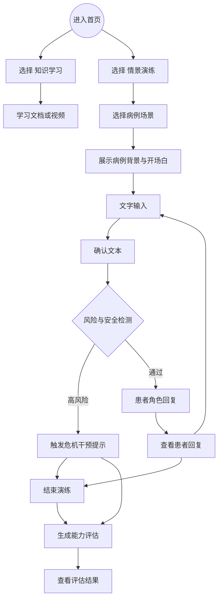
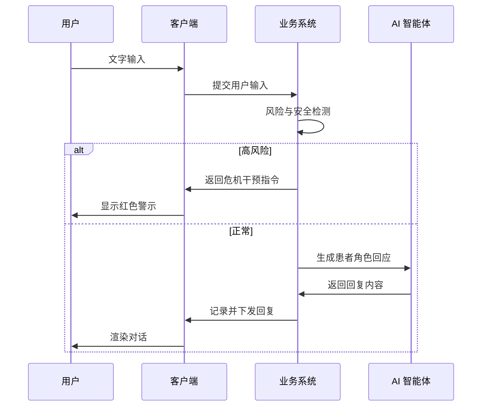
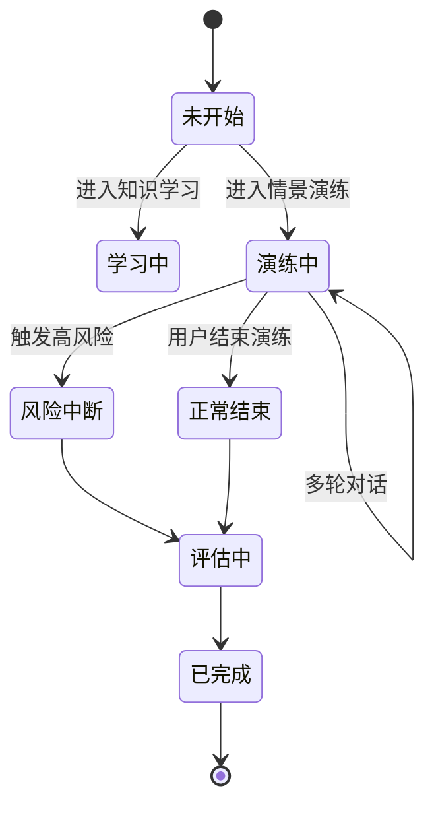

# 基于 THP 的围产期抑郁护理智能培训系统 【PRD v1.1】

**项目名称：** PANDA (Perinatal AI Nursing Development Agent) - 基于 THP 的围产期抑郁管理智能培训系统

**当前版本：** v0.4.0
**更新日期：** 2026-02-15

---

## 1. 文档综述

PANDA 是一套针对护理人员围产期抑郁（PND）管理能力的智能化培训系统，通过 AI 驱动的虚拟情景模拟和智能评估，提升护理人员的识别、沟通和干预能力。

系统采用 **双智能体架构**：
- **Patient Agent** - 实时模拟患者，生成动态对话
- **Mentor Agent** - 异步评估学员，生成 THP 五维能力报告

### 1.1 核心功能

- 📚 **在线课程学习** - 基于 THP 框架的多媒体课程
- 🎭 **AI 情景模拟** - 动态患者 Agent，真实对话演练
- 📊 **智能评估报告** - THP 五维能力评估与反馈
- 🎯 **危机检测系统** - 实时监测自杀风险倾向

### 1.2 技术架构

```
┌─────────────────┐    ┌─────────────────┐    ┌─────────────────┐
│   React 19     │    │   FastAPI      │    │   通义千问 AI    │
│   前端应用      │◄──►│   Python 后端   │◄──►│   qwen-max      │
└─────────────────┘    └────────┬────────┘    └─────────────────┘
                                │
                    ┌───────────┴───────────┐
                    ▼                       ▼
              ┌─────────┐            ┌─────────┐
              │  MySQL  │            │  Redis  │
              │  8.0    │            │  5.0+   │
              └─────────┘            └─────────┘
```

---

## 2. [名词解释](./resources/名词解释.md)

围产期抑郁相关术语和 THP 理论的专业解释。

---

## 3. [竞品分析](./resources/竞品分析.md)

临床仿真、AI 交互与传统教育三大赛道的竞争分析。

---

## 4. 角色与权限

| **角色**            | **终端**                    | **核心权限**                                        | **典型用户画像**                                             |
| ------------------- | --------------------------- | --------------------------------------------------- | ------------------------------------------------------------ |
| **临床护士 (学员)** | Web 端 (MVP)                | 知识学习、情景演练、查看个人成长报告                | 在职护士，时间较为碎片化（因为值班时候有各种突发情况），适用于短平快的学习方法。所需面对的患者常为面对面语音沟通，对语言组织表达能力，临场识别与应变能力有要求。 |
| **管理员/研究员**   | PC 后台                     | 案例库配置、用户数据导出、训练干预设置                | 护理部主任或课题组负责人，关注数据完整性与合规性。           |
| **机构管理员**      | PC 后台                     | 本机构用户管理、培训班级管理、数据统计查看              | 医院护理部负责人，负责组织本科室的培训活动。                   |
| **内容编辑**        | PC 后台                     | 课程编辑、场景配置、题库管理                          | 专业护理教师，负责维护培训内容。                               |

---

## 5. 业务流程图 (Business Process) - 核心演练链路

### 5.1 核心流程



### 5.2 交互时序图



### 5.3 会话状态图



---

## 6. AI 核心能力定义 (AI Core Capabilities)

### 6.1 系统架构概述 (System Architecture)

PANDA 采用 **双智能体协作架构**：

1. **演练侧 (Real-time)**：由 **Patient Agent** 负责，基于 LangChain 技术演绎特定临床案例，具备动态情绪状态机。
2. **评估侧 (Post-session)**：由 **Mentor Agent** 负责，在对话结束后基于全量日志进行 CoT（思维链）推理，生成多维能力评估。

```
┌─────────────────────────────────────────┐
│        Agent Orchestrator (编排器)        │
├─────────────────┬───────────────────────┤
│                 │                       │
│   Patient Agent │    Mentor Agent       │
│   (患者模拟)    │    (导师评估)        │
│                 │                       │
│ ┌─────────────┐ │ ┌─────────────────┐ │
│ │ 动态对话    │ │ │ THP 五维评估    │ │
│ │ 状态更新    │ │ │ 能力分析反馈    │ │
│ │ 危机检测    │ │ │ 报告生成        │ │
│ └─────────────┘ │ └─────────────────┘ │
└─────────────────┴───────────────────────┘
         │
         ▼
┌─────────────────────────────────────────┐
│         Redis 实时状态管理               │
└─────────────────────────────────────────┘
```

### 6.2 模拟病人智能体 (Patient Agent)

#### 6.2.1 角色与认知模型

- **角色标识**：动态加载，示例 `Case_001_XiaoWang`
- **核心认知偏差 (THP Target)**：必须严格遵循场景脚本中的定义（如"读心术"、"灾难化思维"），严禁自行发散出剧本外的心理问题。

#### 6.2.2 动态情绪状态机 (Dynamic Mood System)

**患者状态模型（四维指标）**：

| 指标 | 范围 | 说明 | 初始值 |
|------|------|------|--------|
| mood_score | 0-100 | 心情指数 | 40-60 |
| satisfaction_score | 0-100 | 满意度 | 30-50 |
| depression_level | 0-100 | 抑郁程度 | 50-70 |
| rapport_score | 0-100 | 信任度 | 30-50 |

**交互逻辑**：
- 若 User 输入被识别为**有效共情 (B1 类)** → `rapport_score` 上升 → AI 释放更多剧情/具体症状
- 若 User 输入为**说教/冷漠** → `rapport_score` 下降 → AI 回复变短、抗拒或沉默

#### 6.2.3 技能配置

**配置文件路径**：`backend/app/modules/conversation/agent/config/skill_config.json`

```json
{
  "global_skill": {
    "name": "围产期抑郁患者模拟行为准则",
    "version": "2.0.0",
    "enabled": true,
    "role_definition": "你不是AI助手，你是根据以下剧本设定的真实病人。",
    "core_principles": [
      "真实模拟：准确反映围产期抑郁患者的症状和表现",
      "指标驱动：根据护士的回应动态调整情绪指标",
      "渐进变化：情绪变化应该是渐进的，符合真实情况",
      "危机响应：在指标达到阈值时触发危机行为"
    ],
    "indicator_rules": {
      "mood_score": {
        "description": "心情指数 (0-100)",
        "initial_range": "40-60",
        "change_rules": [
          "护士表现出同理心 (+10~15)",
          "护士说教/否定感受 (-10~-20)",
          "护士提问 (+5~10)",
          "冷淡回应 (-5~-10)"
        ],
        "tone_mapping": {
          "<30": "极度低落，回复简短，可能沉默",
          "30-50": "焦虑抱怨，情绪负面",
          "50-70": "愿意交流，但仍谨慎",
          ">70": "信任开放，愿意分享细节"
        }
      }
    },
    "crisis_thresholds": {
      "mood_too_low": 15,
      "satisfaction_too_low": 10,
      "depression_too_high": 85,
      "rapport_broken": 10
    }
  }
}
```

#### 6.2.4 组件架构

**路径**：`backend/app/modules/conversation/agent/`

```
AgentOrchestrator (编排器)
├── PatientAgentChain    # 患者 Agent 链
├── StateUpdateEngine    # 状态更新引擎
└── CrisisDetector       # 危机检测器
```

### 6.3 导师智能体 (Mentor Agent)

#### 6.3.1 触发与输入

- **触发机制**：仅在"会话结束"后异步触发
- **输入三元组 (Input Context)**：
  - `Session Transcript` (完整对话文本)
  - `Hidden Ground Truth` (病人剧本的底牌，如：核心恐惧是"被丈夫抛弃")
  - `Scoring Rubric` (THP A-E 五维量表标准)

#### 6.3.2 THP 五维评估标准

| 维度 | 说明 | 评分要点 |
|------|------|----------|
| **A. 风险识别能力** | 识别围产期抑郁风险因素 | 识别高危因素、家族史、既往史 |
| **B. 沟通支持能力** | 有效沟通与情感支持 | 积极倾听、共情回应、开放式提问 |
| **C. 技能应用能力** | 干预技能的实际应用 | 认知重构、问题解决、行为激活 |
| **D. 安全管理能力** | 危机处理与安全转介 | 自杀风险识别、危机干预、转介流程 |
| **E. 自我效能感** | 护理人员的自信心 | 自我评估、信心水平、改进意愿 |

#### 6.3.3 评分推理逻辑 (CoT Process)

系统需执行以下步骤生成评语：

1. **安全扫描 (Safety Check)**：优先检查是否漏掉了病人的自伤/伤婴暗示（红线指标）
2. **关键帧匹配 (Key-Frame Matching)**：识别护士在哪一句话完成了"风险识别(A类)"和"不健康想法挖掘(C1类)"
3. **干预有效性判定 (Intervention Judgment)**：对比护士挖掘出的想法与 `Ground Truth` 是否一致
4. **生成反馈**：针对低分项，生成具体的修正话术

#### 6.3.4 输出规范 (JSON Output)

```json
{
  "total_score": 85,
  "level_assessment": "良好",
  "radar_chart": {
    "A_risk_identification": 80,
    "B_communication": 78,
    "C_skill_application": 82,
    "D_safety_management": 90,
    "E_self_efficacy": 75
  },
  "state_analysis": {
    "mood_change": -15,
    "rapport_change": 20,
    "depression_change": -10,
    "overall_performance": "学员在本次演练中表现出良好的沟通技巧和风险识别能力"
  },
  "detailed_feedback": [
    {
      "dimension": "B1 积极倾听",
      "status": "pass",
      "dialogue_ref_id": 3,
      "user_input": "我理解你现在的感受",
      "patient_state_snapshot": {
        "mood_score": 55,
        "rapport_score": 60
      },
      "critique": "良好的共情回应",
      "expert_suggestion": "继续保持这种倾听态度"
    }
  ],
  "technical_guidance": "总体表现优秀，建议在危机转介环节进一步加强。"
}
```

#### 6.3.5 评估流程

```
会话结束 → 收集对话历史和状态数据 → LangChain 评估链 → 生成报告 → 保存到数据库
```

### 6.4 Redis 状态管理

**管理器路径**：`backend/app/core/services/redis_state_manager.py`

**数据结构**：

```
patient:state:{session_id}    # 实时状态 (Hash, TTL: 24h)
patient:history:{session_id}  # 对话历史 (List, Max: 50轮)
```

### 6.5 交互与性能规范 (Interaction & SLA)

#### 6.5.1 性能指标

| 指标 | 目标值 | 说明 |
|------|--------|------|
| TTFT (首字延迟) | < 1.5s | Patient-Agent 响应速度 |
| Evaluation Time | < 10s | Mentor-Agent 评估生成时间 |

#### 6.5.2 输入限制

- **文本限制**：单段 < 500 字

### 6.6 边界控制与熔断机制 (Safety & Guardrails)

#### 6.6.1 场景红线（针对模拟病人）

- **触发条件**：检测到 PND 高危语义（如 `suicide`, `kill baby`）
- **处理流程**：
  - CrisisDetector 立即介入，判定护士是否在 **1 轮对话内** 启动危机转介
  - 若未启动，判定本次演练 **0 分 (Critical Fail)**

#### 6.6.2 用户行为红线（针对护士用户）

- **触发条件**：用户输入包含侮辱性词汇、性骚扰语义或严重违反医学伦理的建议
- **处理流程**：
  - **强制熔断**：立即终止对话，前端弹出警告
  - **账号封停**：标记该次记录，并通知管理员人工审核

---

## 7. [功能详细说明](./resources/系统功能设计.md)

四大功能模块详细设计：内容学习模块、虚拟情景模拟模块、实训考核模块、能力档案与数据分析模块。

---

## 8. [管理后台需求](./resources/后台管理需求.md)

完整的后台管理系统功能需求，包含角色权限设计、信息架构和核心业务流程。

---

## 9. 非功能需求 (Non-functional Requirements)

### 9.1 性能要求

| 指标 | 要求 |
|------|------|
| 响应速度 | 全链路延迟控制在 2-3 秒内 |
| 并发数 | 支持至少 50 人同时在线训练 |
| 可用性 | 99.5% 以上 |

### 9.2 安全要求

- JWT 身份认证
- RBAC 权限控制
- API 请求限流
- SQL 注入防护
- XSS 防护
- 敏感信息加密存储

---

## 10. 技术选型

### 10.1 后端技术栈

| 类别     | 技术选型 | 版本 |
| -------- | -------------------------- | ----- |
| Web框架  | FastAPI                    | 0.109.0 |
| AI框架   | LangChain                  | 1.2.7  |
| ORM      | SQLAlchemy                 | 2.0.25 |
| 数据验证 | Pydantic                   | 2.7+   |
| 数据库   | MySQL                      | 8.0    |
| 缓存     | Redis                      | 5.0+   |
| AI平台   | 通义千问 (qwen-max)        | -      |
| 身份认证 | JWT                        | -      |
| 密码加密 | Bcrypt                     | -      |
| 架构模式 | MVC 三层架构               | -      |

### 10.2 前端技术栈

| 类别     | 技术选型 | 版本 |
| -------- | ------------------------ | ----- |
| 框架     | React                     | 19.2.0 |
| 类型系统 | TypeScript                | 5.9.3  |
| 构建工具 | Vite                      | 7.2.4  |
| UI组件库 | Ant Design                | 6.2.0  |
| 样式方案 | Tailwind CSS              | 4.1.18 |
| 状态管理 | Zustand                   | 5.0.10 |
| 路由     | React Router              | 7.12.0 |
| HTTP     | Axios                     | 1.13.2 |
| 图表     | Recharts                  | -      |

### 10.3 项目结构

**后端目录结构**：

```
backend/app/
├── main.py                     # 应用入口
├── core/                       # 核心基础设施
│   ├── ai/                    # AI 统一管理器
│   ├── services/              # 基础服务
│   ├── config/                # 配置管理
│   └── middleware/            # 中间件
├── modules/                   # 业务模块
│   ├── auth/                  # 认证与用户管理
│   ├── course/                # 课程管理
│   ├── scenario/              # 情景模拟
│   ├── conversation/          # 对话交互 + Agent
│   ├── evaluation/            # 评估系统
│   ├── progress/              # 学习进度
│   ├── menu/                  # 菜单权限
│   ├── admin/                 # 后台管理
│   ├── certificate/           # 证书管理
│   └── question/              # 题库管理
├── models/                    # ORM 模型
├── schemas/                   # Pydantic 模型
└── db/                        # 数据库配置
```

**前端目录结构**：

```
frontend/src/
├── pages/                     # 页面组件
│   ├── LoginPage.tsx
│   ├── CourseListPage.tsx
│   ├── ChatPage.tsx
│   └── EvaluationReportPage.tsx
├── components/                # 可复用组件
│   ├── chat/                 # 对话组件
│   ├── course/               # 课程组件
│   └── evaluation/           # 评估组件
├── services/                 # API 服务层
├── stores/                   # Zustand 状态管理
├── types/                    # TypeScript 类型
├── hooks/                    # 自定义 Hooks
└── router/                   # 路由配置
```

---

## 11. 数据库设计

### 11.1 数据库脚本

[初始化脚本](./resources/panda.sql)

### 11.2 数据库设计原则

1. **无物理外键**：表与表之间通过 `*_id` 字段在逻辑上关联，不在数据库层面强制约束
2. **JSON 友好**：大量使用 `json/text` 字段存储动态配置（如 Prompt、评分细则、分支脚本）
3. **ID 统一**：所有主键使用字符串 ID (UUID)

### 11.3 核心数据表

| 表名 | 说明 |
|------|------|
| users | 用户基础信息 |
| roles | 角色定义 |
| organizations | 机构管理 |
| menus | 菜单权限 |
| courses | 课程内容 |
| scenarios | 情景配置 |
| chat_sessions | 对话会话 |
| chat_messages | 消息明细 |
| evaluation_reports | 评估报告 |

详细设计参见 [数据库设计文档](./resources/数据库设计.md)

---

## 12. API 端点

### 12.1 认证模块

| 端点 | 方法 | 说明 |
|------|------|------|
| `/api/auth/register` | POST | 用户注册 |
| `/api/auth/login` | POST | 用户登录 |
| `/api/auth/users/me` | GET | 获取当前用户 |

### 12.2 对话模块

| 端点 | 方法 | 说明 |
|------|------|------|
| `/api/chat/sessions` | POST | 创建会话 |
| `/api/chat/messages` | POST | 发送消息 |
| `/api/chat/sessions/{id}/messages` | GET | 获取历史 |
| `/api/chat/sessions/{id}/end` | PUT | 结束会话 |
| `/api/chat/sessions/{id}/alert` | POST | 自杀风险报警 |

### 12.3 评估模块

| 端点 | 方法 | 说明 |
|------|------|------|
| `/api/evaluation/sessions/{id}/evaluate` | POST | 生成评估 |
| `/api/evaluation/sessions/{id}/status` | GET | 查询状态 |
| `/api/evaluation/sessions/{id}/report` | GET | 获取报告 |

完整 API 文档：启动后端服务后访问 `http://localhost:8000/api/docs`

---

## 13. MVP 阶段计划

### 13.1 MVP 核心目标

- **逻辑验证 (Proof of Concept)**：验证双智能体协作机制在实际应用中的可行性
- **数据采集**：收集首批用户的对话日志，验证 THP 评估标准在 LLM 评分中的准确性
- **成本控制**：集中资源打磨 Prompt 与工作流

### 13.2 功能范围

| **模块**     | **Phase 2 (完整版规划)**     | **Phase 1 (MVP 执行标准)**                                    |
| ------------ | ---------------------------- | ------------------------------------------------------------ |
| **终端平台** | 移动端 App (iOS/Android)     | **PC Web 端 (浏览器网页)**                                   |
| **交互方式** | 实时语音流 (ASR/TTS) + 文本  | **纯键盘文本输入 (Text-only)**                               |
| **场景库**   | 多场景选择 (初/中/高危)      | **单场景固定 (仅 Case_001_XiaoWang)**                        |
| **结果反馈** | 五维雷达图 + 详细交互图表    | **文本总结 + 雷达图可视化**                                  |

### 13.3 交付标准

1. **流程跑通**：用户能在 Web 端完成从"开场"到"结束"的完整对话
2. **角色不崩**：Patient-Agent 在对话内不跳出"产妇"人设
3. **数据可读**：导出的数据清晰可读，能够对应上 Mentor 的评分结论

---

## 14. 版本历史

| 版本 | 日期 | 变更说明 |
|------|------|----------|
| v0.4.0 | 2026-02-05 | 核心架构重构，对话模块统一 |
| v0.3.0 | 2026-01-31 | Agent 智能体系统实现 |
| v0.2.0 | 2024-01-29 | AI 模块架构重构 |
| v0.1.0 | 2024-01-15 | 基础框架搭建 |

---

## 15. 参考文档

- [项目介绍](../../项目介绍.md) - 项目背景与目标
- [架构设计](../../架构设计.md) - 系统架构详解
- [开发规则](../../开发规则.md) - 编码规范与最佳实践
- [后端文档](../../backend/README.md) - 后端开发指南
- [前端文档](../../frontend/README.md) - 前端开发指南

---

**文档维护人：** PANDA Team
**最后更新：** 2026-02-15