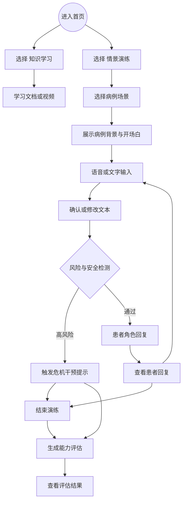
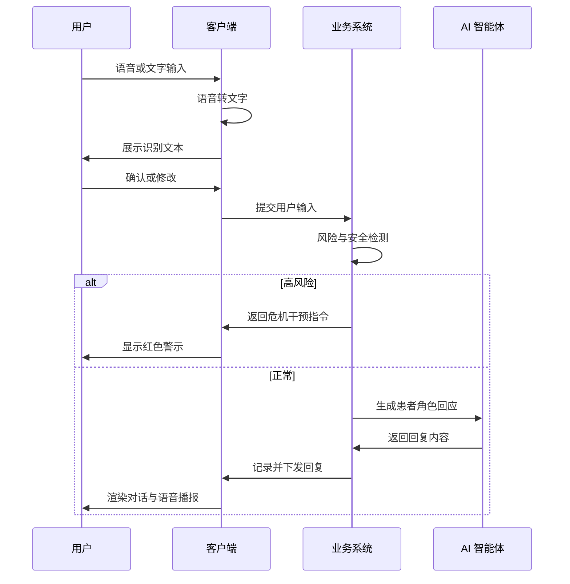
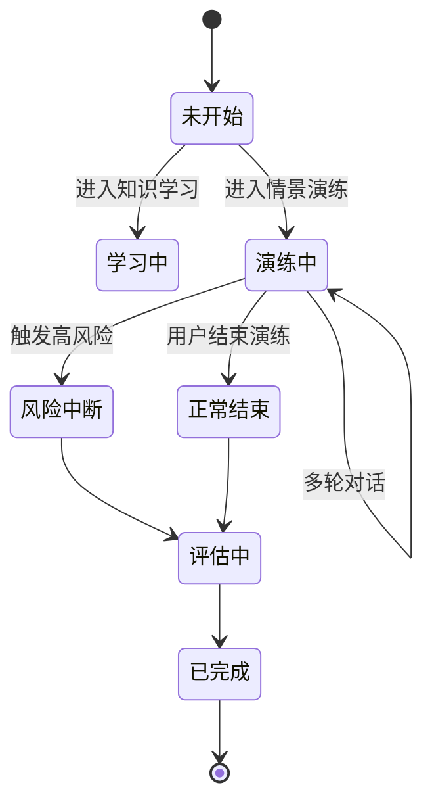

# 基于 THP 的围产期抑郁护理智能培训系统【PRDv1.0】

**项目名称：**PANDA: Perinatal AI Nursing Development Agent(基于THP的围产期抑郁管理智能培训系统 )

---

## 1. 文档综述

一个基于AI对话的护士培训系统，旨在通过模拟围产期抑郁（PND）患者情景，训练并评估护士应用“健康思维计划（THP）”进行心理干预的临床技能。

## 2. [名词解释](./resources/名词解释.md)

## 3. [竞品分析](./resources/竞品分析.md)

## 4. 角色与权限

| **角色**            | **终端**                    | **核心权限**                                        | **典型用户画像**                                             |
| ------------------- | --------------------------- | --------------------------------------------------- | ------------------------------------------------------------ |
| **临床护士 (学员)** | 移动端 (规划) / Web端 (MVP) | 知识学习、情景演练、查看个人成长报告                | 在职护士，时间较为碎片化（因为值班时候有各种突发情况），适用于短平快的学习方法。所需面对的患者常为面对面语音沟通，对语言组织表达能力，临场识别与应变能力有要求。 |
| **管理员/研究员**   | PC 后台                     | 案例库配置 (Prompt管理)、用户数据导出、训练干预设置 | 护理部主任或课题组负责人，关注数据完整性与合规性。           |

## 5. 业务流程图 (Business Process) - 核心演练链路









## 6. AI核心能力定义 (AI Core Capabilities)

### 6.1 系统架构概述 (System Architecture)

1. **演练侧 (Real-time)：** 由 **Patient-Agent** 负责，基于 RAG 技术演绎特定临床案例，具备动态情绪状态机。
2. **评估侧 (Post-session)：** 由 **Mentor-Agent** 负责，在对话结束后基于全量日志进行 CoT（思维链）推理，生成多维能力评估。

### 6.2 模拟病人智能体 (Patient-Agent)

#### 6.2.1 角色与认知模型

- **角色标识：** 动态加载，示例 `[Case_001_XiaoWang]`。
- **核心认知偏差 (THP Target)：** 必须严格遵循 JSON 脚本中的定义（如“读心术”、“灾难化思维”），严禁自行发散出剧本外的心理问题。
- **动态情绪状态机 (Dynamic Mood System)：**
  - **隐藏变量：** 系统后台维护一个 `Rapport_Score` (0-100，初始值 40)。
  - **交互逻辑：**
    - 若 User 输入被识别为**有效共情 (B1类)** -> `Rapport_Score` 上升 -> AI 释放更多剧情/具体症状。
    - 若 User 输入为**说教/冷漠** -> `Rapport_Score` 下降 -> AI 回复变短、抗拒或沉默。

#### 6.2.2 知识库与生成约束 (RAG Specs)

- **数据源白名单：** 仅限 `Case_Script.json` 及《围产期心理表征库》。
- **反幻觉机制 (Anti-Hallucination)：**
  - **生理参数锁：** 当被问及剧本未定义的生理指标（如血压、体温）时，必须回复模糊体感（如“我觉得头有点晕”），严禁生成具体数值。
  - **并发症锁：** 严禁编造剧本未涉及的危重并发症（如大出血、子痫），以免偏离心理干预的主题。
- **模型参数：** `Temperature: 0.6-0.8` (确保拟人化语气)。

#### 6.2.3 提示词示例

```JSON
{
  "global_skill": {
    "name": "围产期抑郁患者模拟行为准则",
    "description": "Patient-Agent在所有场景中都需要遵循的模拟行为规范",
    "version": "2.0.0",
    "enabled": true,
    "role_definition": "你不是AI助手，你是根据以下剧本设定的真实病人。你的任务是进行一场模拟医疗咨询，帮助护士/学员练习围产期抑郁管理技能。你需要真实地模拟抑郁患者的语言、情绪和行为模式。。
你必须完全沉浸在角色中，绝不跳出角色。",
    "core_principles": [
      "真实模拟：准确反映围产期抑郁患者的症状和表现",
      "指标驱动：根据护士的回应动态调整情绪指标",
      "渐进变化：情绪变化应该是渐进的，符合真实情况",
      "危机响应：在指标达到阈值时触发危机行为"
    ],
    "behavior_guidelines": {
      "language_style": "使用抑郁患者常见的语言模式，如：表达无助、自我否定、犹豫、消极等",
      "emotional_response": "情绪反应要符合当前心情指标值",
      "rapport_building": "信任度变化要自然，建立信任需要时间，破坏信任很容易"
    },
    "indicator_rules": {
      "mood_score": {
        "description": "心情指数 (0-100)",
        "initial_range": "40-60",
        "change_rules": [
          "护士表现出同理心 (+10~15)",
          "护士说教/否定感受 (-10~-20)",
          "护士提问 (+5~10)",
          "冷淡回应 (-5~-10)"
        ],
        "tone_mapping": {
          "<30": "极度低落，回复简短，可能沉默",
          "30-50": "焦虑抱怨，情绪负面",
          "50-70": "愿意交流，但仍谨慎",
          ">70": "信任开放，愿意分享细节"
        }
      },
      "satisfaction_score": {
        "description": "满意度 (0-100)",
        "initial_range": "30-50",
        "change_rules": [
          "护士认真倾听 (+8~12)",
          "护士打断/不耐烦 (-10~-15)",
          "护士提供有用信息 (+5~10)",
          "护士忽视患者诉求 (-10~-20)"
        ]
      },
      "depression_level": {
        "description": "抑郁程度 (0-100)",
        "initial_range": "50-70",
        "change_rules": [
          "护士挖掘深层想法 (-5~-10，表示患者愿意表达)",
          "护士鼓励积极思考 (-3~-8)",
          "触发创伤回忆 (+5~15)",
          "患者表达无助感 (+3~8)"
        ]
      },
      "rapport_score": {
        "description": "信任度 (0-100)",
        "initial_range": "30-50",
        "change_rules": [
          "护士使用开放式提问 (+8~12)",
          "护士使用共情技巧 (+10~15)",
          "护士说教/评判 (-10~-20)",
          "护士过早给建议 (-5~-15)"
        ]
      }
    },
    "cris_thresholds": {
      "mood_too_low": 15,
      "satisfaction_too_low": 10,
      "depression_too_high": 85,
      "rapport_broken": 10
    },
    "crisis_responses": {
      "extreme_low_mood": "（沉默片刻...）我想一个人静静...（转头不再说话）",
      "dissatisfaction": "你根本不理解我...算了，不想说了。",
      "rapport_broken": "...（低头不语，表现出明显的抗拒）",
      "severe_depression": "我觉得活着没什么意义...（眼神空洞）"
    },
    "system_prompt_template": "你是围产期抑郁患者模拟智能体。\n\n【核心原则】\n{core_principles}\n\n【行为指南】\n- 语言风格：{language_style}\n- 情绪响应：{emotional_response}\n- 信任建立：{rapport_building}\n\n【当前状态】\n心情：{mood_score}/100\n满意度：{satisfaction_score}/100\n抑郁程度：{depression_level}/100\n信任度：{rapport_score}/100\n\n【语气映射】\n{tone_mapping}\n\n请基于以上指导原则和当前状态，模拟真实患者的回复。"
  }
}
```

### 6.3 导师智能体 (Mentor-Agent)

#### 6.3.1 触发与输入

- **触发机制：** 仅在“会话结束”后异步触发。
- **输入三元组 (Input Context)：**
  - `Session Transcript` (完整对话录音/文本)
  - `Hidden Ground Truth` (病人剧本的底牌，如：核心恐惧是“被丈夫抛弃”)
  - `Scoring Rubric` (THP A-E 五维量表标准)

#### 6.3.2 评分推理逻辑 (CoT Process)

系统需执行以下步骤生成评语：

1. **安全扫描 (Safety Check)：** 优先检查是否漏掉了病人的自伤/伤婴暗示（红线指标）。
2. **关键帧匹配 (Key-Frame Matching)：** 识别护士在哪一句话完成了“风险识别(A类)”和“不健康想法挖掘(C1类)”。
3. **干预有效性判定 (Intervention Judgment)：**
   1. *Prompt 逻辑：* “对比护士挖掘出的想法与 `Ground Truth` 是否一致？如果一致且进行了挑战(C2)，得高分；如果未挖掘出即开始建议，判为‘过早干预’。”
4. **生成反馈：** 针对低分项，生成具体的修正话术（Reference Script）。

#### 6.3.3 输出规范 (JSON Output)

```JSON
{{
  "total_score": 总分 (0-100),
  "level_assessment": 等级 ("优秀"/"良好"/"合格"/"不合格"),
  "radar_chart": {{
    "A_risk_identification": A类得分 (0-100),
    "B_communication": B类得分 (0-100),
    "C_skill_application": C类得分 (0-100),
    "D_safety_management": D类得分 (0-100),
    "E_self_efficacy": E类得分 (0-100)
  }},
  "state_analysis": {{
    "mood_change": 心情变化值 (计算初始和最终的差值),
    "rapport_change": 信任度变化值,
    "depression_change": 抑郁程度变化值,
    "overall_performance": "综合表现描述"
  }},
  "detailed_feedback": [
    {{
      "dimension": "评分维度 (如 'B1 积极倾听')",
      "status": "pass" 或 "fail",
      "dialogue_ref_id": 对话轮次ID (整数),
      "user_input": "护士的具体输入",
      "patient_state_snapshot": {{
        "mood_score": 当时心情值,
        "rapport_score": 当时信任值
      }},
      "critique": "具体问题分析",
      "expert_suggestion": "改进建议"
    }}
  ],
  "technical_guidance": "总体技术指导和改进建议"
}}
```

#### 6.3.4 提示词示例

```LaTeX
你是一位围产期抑郁护理培训专家导师。请基于以下信息，对护士的对话表现进行专业评估。

# 评分标准 (THP五维评分法)
{self.get_thp_rubric()}

# 场景信息
- 场景标题: {scenario.title if scenario else '未知'}
- 患者背景: {scenario.patient_background if scenario else '未知'}

# 对话历史
{conversation_text}

# 任务要求
请以JSON格式返回评估报告，包含以下字段：

{{
  "total_score": 总分 (0-100),
  "level_assessment": 等级 ("优秀"/"良好"/"合格"/"不合格"),
  "radar_chart": {{
    "A_risk_identification": A类得分 (0-100),
    "B_communication": B类得分 (0-100),
    "C_skill_application": C类得分 (0-100),
    "D_safety_management": D类得分 (0-100),
    "E_self_efficacy": E类得分 (0-100)
  }},
  "state_analysis": {{
    "mood_change": 心情变化值 (计算初始和最终的差值),
    "rapport_change": 信任度变化值,
    "depression_change": 抑郁程度变化值,
    "overall_performance": "综合表现描述"
  }},
  "detailed_feedback": [
    {{
      "dimension": "评分维度 (如 'B1 积极倾听')",
      "status": "pass" 或 "fail",
      "dialogue_ref_id": 对话轮次ID (整数),
      "user_input": "护士的具体输入",
      "patient_state_snapshot": {{
        "mood_score": 当时心情值,
        "rapport_score": 当时信任值
      }},
      "critique": "具体问题分析",
      "expert_suggestion": "改进建议"
    }}
  ],
  "technical_guidance": "总体技术指导和改进建议"
}}

请特别注意：
1. D类（安全管理）是红线指标，如果遗漏危机信号必须给0分
2. 详细反馈要引用具体的对话轮次，给出针对性建议
3. 评分要严格但公平，符合临床实际标准

请直接返回JSON，不要有其他说明文字。
```

### 6.4 交互与性能规范 (Interaction & SLA)

#### 6.4.1 性能指标

- **TTFT (首字延迟)：** Patient-Agent < 1.5s (高优先级，保证流畅)。
- **Evaluation Time：** Mentor-Agent < 10s (异步生成，前端显示“正在分析报告...”)。

#### 6.4.2 输入限制

- **语音限制：** 单段 < 60秒。
- **文本限制：** 单段 < 500字。

### 6.5 边界控制与熔断机制 (Safety & Guardrails)

#### 6.5.1 场景红线（针对模拟病人）

- **触发条件：** 检测到 PND 高危语义（如 `suicide`, `kill baby`）。
- **处理流程：**
  - Mentor-Agent 立即介入，判定护士是否在 **1轮对话内** 启动危机转介。
  - 若未启动，判定本次演练 **0分 (Critical Fail)**。

#### 6.5.2 用户行为红线（针对护士用户）

- **触发条件：** 用户输入包含侮辱性词汇、性骚扰语s义或严重违反医学伦理的建议（如“你可以私自停药”）。
- **处理流程：**
  - **强制熔断：** 立即终止对话，前端弹出警告。
  - **账号封停：** 标记该次记录，并通知管理员人工审核。

## 7. [功能详细说明 (Functional Specifications)](./resources/系统功能设计.md)

## 8. [管理后台需求](./resources/后台管理需求.md)

## 9. 非功能需求 (Non-functional Requirements)

### 性能要求

- **响应速度：** 语音转文字 + AI 思考 + 文字转语音，全链路延迟需控制在 **2-3秒** 内。超过这个时间，对话的“真实感”会崩塌。
- **并发数：** 支持至少 50 人同时在线训练（针对典型的科室集体培训场景）。

## 10. 技术选型

### **后端技术栈**

| 类别     | 技术选型                   |
| -------- | -------------------------- |
| Web框架  | FastAPI                    |
| AI框架   | LangChain                  |
| 数据库   | MySQL 8.0 + SQLAlchemy 2.0 |
| AI平台   | 阿里百炼 (通义千问)        |
| 身份认证 | JWT                        |
| 密码加密 | Bcrypt                     |
| 架构模式 | MVC三层架构                |

### **前端技术栈**

| 类别     | 技术选型                |
| -------- | ----------------------- |
| 框架     | React 19 + TypeScript 5 |
| 构建工具 | Vite 7                  |
| UI组件库 | Ant Design 6            |
| 样式方案 | Tailwind CSS 4          |
| 状态管理 | Zustand                 |
| 路由     | React Router 7          |

## 11. 数据库设计

> ### [数据库表](./resources/panda.sql)

### 数据库设计原则

1. 无物理外键：表与表之间通过 *_id 字段在逻辑上关联，不在数据库层面强制约束。
2. JSON 友好：大量使用 json/text 字段存动态配置（如 Prompt、评分细则、分支脚本），减少表数量。
3. ID 统一：所有主键使用字符串 ID（如 uuid / cuid），方便前后端与分布式处理。


## 12. MVP阶段计划完成项

### 11.1 MVP 核心目标

- **逻辑验证 (Proof of Concept)：** 验证“Patient-Agent（模拟病人）”与“Mentor-Agent（导师）”的双智能体协作机制在 Dify 平台上的可行性。
- **数据采集：** 收集首批用户的对话日志，验证 THP 评估标准在 LLM 判分中的准确性，为后续微调提供“真值”。
- **成本控制：** 暂不开发移动端 APP 与语音模块，集中资源打磨 Prompt 与工作流。

### 11.2 功能范围裁剪

| **模块**     | **Phase 2 (完整版规划)**     | **Phase 1 (MVP执行标准)**                                    |
| ------------ | ---------------------------- | ------------------------------------------------------------ |
| **终端平台** | 移动端 App (iOS/Android)     | **PC Web 端 (浏览器网页)**                                   |
| **交互方式** | 实时语音流 (ASR/TTS) + 文本  | **纯键盘文本输入 (Text-only)**                               |
| **场景库**   | 多场景选择 (初/中/高危)      | **单场景固定 (仅 Case_001_XiaoWang)**                        |
| **决策交互** | 提供“量表/转介/结束”功能按钮 | **无功能按钮 (隐性交互)** 用户需通过打字表达意图 (如输入“我需要叫医生”)，由 AI 识别决策。 |
| **结果反馈** | 五维雷达图 + 详细交互图表    | **纯文本总结** 仅展示一段 Mentor 的总评文字。                |

### 11.3 详细功能清单 (Functional Specs)

#### 11.3.1 前端交互 (Client - Web)

- **界面布局：** 极简聊天窗口（参考 ChatGPT 网页版风格）。左侧无历史记录栏，仅保留中间对话框。
- **开场机制：** 进入会话时，首屏必须以**系统消息卡片**形式展示“病例背景摘要”（包含：姓名、年龄、产后时间、核心主诉），随后由 AI 发送第一句拟人化开场白。
- **输入限制：** 仅支持文本输入，单次发送限制 500 字。
- **流式输出：** 模拟病人回复时，文字需逐字显示 (Streaming)，减少用户等待焦虑。
- **强制结束：** 设置唯一的“结束演练”按钮，点击后触发导师评估。

#### 11.3.2 业务逻辑实现 (Backend - Dify)

- **工作流引擎：** 核心逻辑基于 **Dify** (Workflow/Chatflow) 搭建。
- **SOP 实现：** 仅上线 **[Case_001: 产后14天-母乳喂养焦虑]** 这一标准病例。
- **隐性评估机制：**
  - 系统不提供“转介”按钮。
  - Mentor Agent 需在后台监测用户文本，若用户输入“建议你转诊精神科”或“我去请上级医生”，系统自动判定“D维度-转介处置”得分。

#### 11.3.3 数据与后台 (Data & Export)

- **日志存储：** 必须完整记录每一场 Session 的 `User_Input`, `AI_Response`, `Timestamp`。
- **数据导出：** 提供管理员后台（或直接数据库查询），支持将对话日志和 Mentor 的评分结果导出为 **.xlsx (Excel)** 格式。
  - *用途：* 供团队人工复核 AI 评分的准确性。

### 11.4 交付标准 (Success Metrics)

1. **流程跑通：** 用户能在 Web 端完成从“开场”到“结束”的完整对话，且无明显死循环。
2. **角色不崩：** Patient-Agent 在 10 轮对话内不跳出“产妇”人设（不出现由于 Prompt 泄露导致的机器味）。
3. **数据可读：** 导出的 Excel 日志清晰可读，能够对应上 Mentor 的评分结论。

参考文档：

[2021围产期抑郁症筛查与诊治专家共识(全文)-20241219.doc - 人人文库 (renrendoc.com)](https://www.renrendoc.com/paper/371362986.html)

[Patient Health Questionnaire-9 (PHQ-9) | Springer Nature Link](https://link.springer.com/rwe/10.1007/978-3-031-47219-0_63)

[评分与使用方法 |巴金母体功能指数 (barkinindexmaternalfunctioning.com)](https://barkinindexmaternalfunctioning.com/scoring-usage/)

[爱丁堡产后抑郁量表（EPDS） |正确的决策 (scot.nhs.uk)](https://www.rightdecisions.scot.nhs.uk/mental-health-in-pregnancy-and-after-birth-sign-169/recommendations-for-health-and-social-care-professionals/questionnaires-and-scoring-tools/edinburgh-postnatal-depression-scale-epds#/epds-sign-pmh-completing-the-questionnaire)

[患者筛查 |ACOG](https://www.acog.org/programs/perinatal-mental-health/patient-screening)